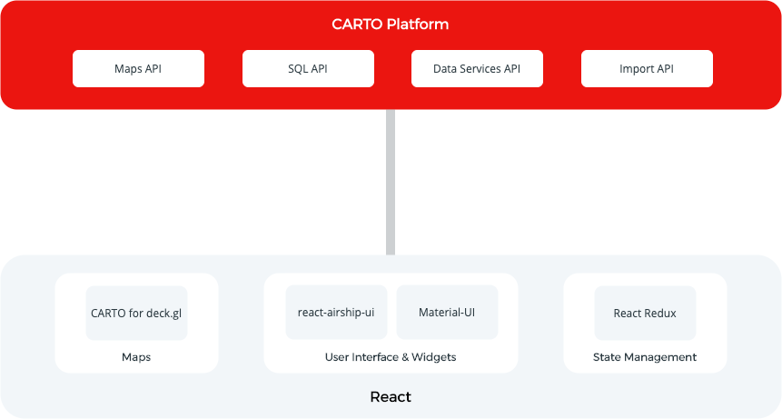

# CARTO Create React App Template Documentation

## What is it?

The CARTO Create React App template is the best way for kickstarting application development with CARTO for deck.gl and React. If you start your application with this template, you will begin with a well designed structure following the best practices for modern frontend development and an integrated toolchain for testing, building and deploying your application. 

Please watch this video to see how easy it is to create your first CARTO React app in 5 minutes. 

Embed a short video tutorial showing how easy it is to create an application and customize it.


## Getting started

If you are a designer, check the sketch files for the design system [here](https://link-to-sketch-files) and for the sample application [here](https://link_to_sample_application_sketch). There is a [Storybook](https://storybook.js.org/) for exploring the UI components available [here](https://react-airship-ui.vercel.app/).

If you are a developer, the template is based on the popular [create-react-app](https://create-react-app.dev/) integrated toolchain. 

The basic prerequisite for using Create React App is to have a package manager ([npm](https://www.npmjs.com/get-npm) or [yarn](https://yarnpkg.com/)) previously installed. Once you have it installed, you can run:


``` shell
npx create-react-app my-app --template @carto
```


A new project will be created for you with everything already setup, including all the dependencies. If you want to start the application in development mode, you can run:


``` shell
npm start
```


When you have your app ready to deploy, you can run:


``` shell
npm run deploy
```

## Architecture



These are the main components/frameworks used:

*   [CARTO for deck.gl](https://carto.com/developers/deck-gl) as the library to visualize maps. For the basemaps you can use either Google Maps or Carto basemaps. 
*   [React](https://reactjs.org/)  as the JavaScript library for building user interfaces and [Redux](https://redux.js.org/) for managing global state for the application. We use [React-Redux](https://react-redux.js.org/) for managing the interactions between the React components with the Redux store. 
*   [Material-UI](https://material-ui.com/): UI React components for faster and easier web development.
*   [react-airship-ui](https://www.npmjs.com/package/@carto/react-airship-ui): CARTO theme for [Material-UI](https://material-ui.com/)  and geospatial ui widgets.

The architecture is based on Redux because its core concepts of managing global application state and actions through reducers is translated in a straightforward way to the objects and actions that we usually manage in a location intelligence application. 

We usually have different components in an application such as maps, tools for interacting with the maps, widgets for showing and filtering information… All these components need to share a global state and the actions we apply to one component might have an effect in the other components. 

With this architecture, we are sure that you can create something manageable even if your application is really complex and includes lots of features with multiple interactions.

If you find this architecture a little overwhelming or a little overkill because your application is not so complex, you can just use CARTO for deck.gl with the [scripting API](https://carto.com/developers/deck-gl/examples/). 


## How-to Guides

This section includes how-to guides to show you how you can work with the boilerplate to build your application. 


### How to adapt the look & feel

When you are building your own application based on the boilerplate, you usually want to adapt the look & feel to use a different typography or define your own primary and secondary colors.

The user interface components are based on Material-UI. We have created a default CARTO theme and you can check the configuration and the different options [here](https://react-airship-ui.vercel.app/). You can customize the theme by changing the theme configuration variables. You can find the variables defined for the CARTO theme in the carto-theme.js file in the react-airship-ui package.

There are lots of properties that you can adapt to your needs. Some of the main configuration properties are:

*   <code>[palette](https://material-ui.com/customization/palette/)</code>. Definition of colors (primary, secondary, error, warning…)
*   <code>[typography](https://material-ui.com/customization/typography/)</code>. Default font family, heading styles, body styles…
*   <code>[breakpoints](https://material-ui.com/customization/breakpoints/)</code>. Support for different screen sizes.


### How to add a new page/view

If you want to add a new view, the first thing you need to do is to create the view. The view is a React component that will return a React element representing the view. 

You need to create a new folder in the **src/components/views** folder with the name of your view (i.e. _new-view_). Inside this new folder, you will create a new function component NewView that will return a React element:


``` javascript
import React from 'react';
import { Typography } from '@material-ui/core';
function NewView() {
  return (
    <Typography color='primary' variant='h1'>
      This is my new view!
    </Typography>
  );
}
export default NewView;
```


After you have created the view, you need to tell the navigation component  what will be the path to access your view. To do that you need to edit the **routes.js** file in the src folder. First you need to import the view:


``` javascript
import NewView from 'components/views/new-view/NewView';
```


Then you need to add a new object in the children array in the routes object. You need to specify the path and the React component that implements the view.


``` javascript
{ path: '/new-view', element: <NewView /> }
```


Finally you need to link to the view from the home page. You need to open the file containing the Home view (**src/components/views/home/Home.js**) and add a new &lt;Link /> element to the &lt;Grid /> element within the &lt;Toolbar /> element. 

``` javascript
<Link
    component={NavLink}
    to='/new-view'
    underline='none'
    variant='button'
    className={classes.navLink}
>
  New View
</Link>
```

### How to add your own layers

This guide will show you how to proceed if you want to add a new layer to your application.

The sample application that is used in the boilerplate is using the credentials from the public account except for the Datasets view where OAuth is used (please check the corresponding How-To Guide). You usually want to access datasets from your CARTO account, so you need to edit the src/config/cartoSlice.js file and add your own credentials to the initialState object:


``` javascript
  initialState: {
    ...
    credentials: {
      username: '<your_username>',
      apiKey: '<your_api_key>',
      serverUrlTemplate: 'https://{user}.carto.com',
    },
    ...
  },
```

Then you need to add a new data source. To do that you need to call the addDataSource reducer passing the id you want to use for the data source and the SQL query to retrieve the data from your CARTO account. You usually want to do that in the effect hook in the component/view that is going to show the dataset.


``` javascript
useEffect(() => {
    dispatch(
      addDataSource({
        id: '<your_dataset_id>',
        data: '<your_sql_query>',
      })
    );
    ...
```


Once you have added your dataset, you can now define your layer. The best practice is to define a LayerStyle object and then create a function that will return the deck.gl layer. You should create a new file within the **src/components/common/map/layers** folder.

If you want to create a choropleth map based on one dataset attribute values and display a legend, you can define a LayerStyle object that includes the following properties:

*   Layer id
*   Title
*   Geometry type
*   Colors for each category/attribute value 
*   Labels for each category/attribute value


``` javascript
export const LayerStyle = {
  id: '<your_layer_id>',
  title: '<your_layer_title>',
  geomType: '<geometry_type>',
  colors: {
    value1: [r1, g1, b1],
    value2: [r2, g2, b2],
    ...
    valueN: [rN, gN, bN]
  },
  labels: {
    value1: '<label1>',
    value2: '<label2>',
    ...
    valueN: '<labelN>'
  },
};
```

The function that returns the layer will create a new deck.gl layer by calling the constructor including the layer id, the data parameter with the SQL query, the credentials and the layer style parameters. Here you can also include the handlers for interactivity or any other parameters supported by deck.gl. The data parameter should be obtained by calling the getFilteredQuery method in the airship-api package with the source parameter. For instance, if we want to add a point layer and specify styles using the LayerStyles object defined above: 


``` javascript
export function YourLayer() {
  const navigate = useNavigate();
  const { yourLayer } = useSelector((state) => state.carto.layers);
  const source = useSelector((state) => selectSourceById(state, yourLayer?.source));

  if (yourLayer && source) {
    return new CartoSQLLayer({
      id: '<your_layer_id>',
      data: getFilteredQuery(source),
      credentials: source.credentials,
      getFillColor: (store) => LayerStyle.colors[store.properties.storetype],
      pointRadiusMinPixels: 3,
    });
  }
}
```

Then you can add the layer to the map by calling the addLayer reducer, again in the effect hook. You need to pass the id for the new layer and the source id defined earlier:

``` javascript
  useEffect(() => {
    dispatch(
      addLayer({
        id: '<your_layer_id>',
        source: '<your_dataset_id'
      })
    );
  }); 
```

You usually want to add to this hook another reducer call to remove the layer from the view when it is time to clean up:


``` javascript
useEffect(() => {
    ...
    return function cleanup() {
      dispatch(removeLayer(<your_layer_id>));
    };
  });
```

### How to change the application layout

If you want to use a different layout for the application, you need to change the **src/component/views/home/Home.js** file and generate your own layout using Material-UI components.

The sample application uses the Material-UI &lt;Grid> component. Within this component we have an &lt;AppBar> component that includes the links to the pages and the user avatar and another &lt;Grid> below the &lt;AppBar> for the page content.

The Grid for the page content defines a left sidebar using the sidebarWrapper class and a map area with the &lt;Map> component and the &lt;Legend> component. The sidebar is itself another &lt;Grid> component 350px wide and taking over the remaining height available, containing an &lt;Outlet> component.

Every view (Stores, KPI…) returns an &lt;Outlet> component that includes the specific components used in that view/page.

You might want to use a different layout using the &lt;Grid> component or other Material-UI component, but you should always have a Map component.


### How to add a new widget

If you want to add a new widget to an existing page/view, you need to go to the file where the view is defined and you need to add the corresponding Widget component. You can find the available widgets in the **src/components/common/widgets** folder.  These widgets implement all the calculations and filtering, and make use of the WidgetUI components from the react-airship-ui package to provide the user interface. You usually want to wrap the WidgetUI component within a WrapperWidgetUI component that includes the title and functionality for collapsing the widget.

For instance, if you want to add a formula widget that displays the sum of the values of a column for all the features in the current viewport, you will add this JSX code to the React element returned by the view:


``` javascript
<FormulaWidget
    title='<widget_title>'
    data-source='<your_datasource_id>'
    operation-column='<your_column_name>'
    operation={AggregationTypes.SUM}
    viewport-filter
>
</FormulaWidget>
```


### How to use OAuth with your application

CARTO supports OAuth for accessing the datasets in your CARTO account. The Datasets view in the sample application includes an example showing how to list and load datasets from your account. 

OAuth is the preferred way to manage credentials in CARTO so we recommend you use this protocol for implementing authentication & authorization in your applications.

If you want to integrate your application with CARTO using OAuth, the first thing you need to do is go to your CARTO dashboard and create a new OAuth app as described in the [documentation](https://carto.com/developers/fundamentals/authorization/#oauth-apps), in order to get the clientID for your application.

Then you need to edit the src/config/oauthSlice.js file and modify the clientId property. You can also modify the OAuth scope to specify what permissions you want to give the application.

When you want the users to authenticate and give access to their CARTO account (it can be when loading the application or when you are using a restricted feature), you need to use the OAuthLogin component. This will display a popup with the implicit OAuth flow.

Once the flow has been completed you can get the user credentials like this:


``` javascript
import {selectCredentials} from 'config/oauthSlice';
const credentials = useSelector(selectCredentials);
```


This credentials can be used, for instance, when adding a new data source using the reducer:


``` javascript
dispatch(
  addDataSource({
    id: '<your_dataset_id>',
    data: '<your_sql_query>',
    credentials
   })
);
```


The credentials object contains the username and the API key so you can use them to call any of the CARTO REST APIsOK endpoints. The easiest way to call the REST APIs will be to use the CARTO JavaScript SDK (@carto/sdk).


### How to create a new tool

If you want to create a new tool that interacts with the map and the widgets, you can take a look at the lasso tool.

To be completed when the lasso tool is ready.


## Frequently Asked Questions (FAQ)

Q: Installing npm modules, learning React with Redux, learning Material-UI, it is just too much for my application, is there a simpler way?

A: If your application is not so complex and does not need the benefits added by this template, you can just use CARTO for deck.gl with the scripting API. Please check the [examples](https://carto.com/developers/deck-gl/examples/). 

Q: I’m using Vue or Angular for building my applications, what are my options?

A: At this moment, we only have a template for React using Create React App. If you are building an application using Vue, Angular or other JavaScript framework, you don’t have to worry, it is completely feasible and you just need to use the CARTO for deck.gl pure JavaScript flavor. Please check the [example](https://github.com/CartoDB/viz-doc/tree/master/deck.gl/examples/pure-js).


## Sample Application

The template, when installed, creates a sample application with a simple layout (toolbar, left sidebar and map area). The application uses a dataset with retail locations and another related dataset with the monthly revenue information for each location. 

The main goal is to show how you can implement commonly found features in location intelligence applications using the boilerplate architecture. The application includes the following views/pages:


*   **Stores view**. This view demonstrates how to:
    *   Visualize a CARTO dataset applying a by-value style (color based on store type) and create a corresponding legend. 
    *   Include interactive data-driven widgets that allow the users to get information about the dataset and filter the information in the map.
        *   Formula widget showing the total revenue from all the stores
        *   Category widget showing the revenue by store type
        *   Histogram widget showing revenue buckets
    *   Search a location by address, city… using CARTO geocoding services through the Data Services API and zoom to the results.
    *   Create a tool (lasso) that interacts with the map and the widgets. The user will draw a polygon and the stores will get filtered, both in the map and the widgets.
    *   Display information about a feature when hovering over. When we hover over the store, we will display a pop-up or tooltip with the total revenue for the store.
    *   Select a feature and display detailed information. When we click on a store, the map will be centered in the location and the store will be highlighted. The following information will be displayed in the sidebar:
        *   The nearest 3 stores with a link to them, distance and total revenue
        *   Total revenue of the store
        *   Histogram (line chart) with the store revenue per month, showing the average per month of all stores for comparison
*   **KPI view**. This view shows how to:
    *   Visualize a CARTO dataset using a choropleth map with manual breaks where the store color depends on the total revenue per area and create a corresponding legend. 
    *   Include interactive data-driven widgets that allow the users to get information about the dataset and filter the information in the map.
        *   Formula widget with the total revenue from all stores
        *   Category widget showing the total revenue per area
        *   Histogram widget showing the total revenue per month
*   **Isochrones view**. This view demonstrates how to:
    *   Calculate isochrones using CARTO Data Services API. We can select a store from a list in the sidebar and calculate isochrones specifying the mode (car or walking) and range (time in minutes)
*   **Datasets view**. This view shows how to:
    *   Display the list of datasets from the user CARTO account using OAuth and the CARTO Datasets API. 
    *   Add a dataset from the user CARTO account to the map with a default style. 


## Appendix. Application file structure

If you look at the code, you will find the package. json file in the root directory with all the package dependencies, along with the README.md with basic instructions for starting the app in development mode, launch the tests, build the application for production and more.

The public directory includes the index.html file, that is a standard create-react-app index.html file with the only addition of the Montserrat font, the manifest.json file and some icons and logos.

The src directory contains the code for the application organized as follows:

*   src root folder
*   The main App component (App.js) that setups the routes using react-router-dom and the application theme using Material-UI
*   The index.js file that reads the store from the config/store file and defines the basic layout for the application, rendering it to the #root HTML element. The outermost component is React.StrictMode that adds additional checks and warnings for the inner components. Inside the StrictMode component we have the redux Provider component initialized with the store property. Inside the Provider component we have the react-router-dom BrowserRouter component for managing the routes within the application and finally inside this component we have our App component:

    ``` javascript
    <React.StrictMode>
        <Provider store={store}>
            <BrowserRouter>
            <App />
            </BrowserRouter>
        </Provider>
    </React.StrictMode>
    ```


*   The routes.js file where the different application routes used by react-router-dom are defined
*   The standard serviceWorker.js and setupTests.js files created by create-react-app
*   components folder
    *   The common/map subfolder contains the main classes for working with the map (Map.js) and the layers. 
        *   The basemap type (Mapbox or Google Maps) is defined in the state.carto.baseMap state variable. 
        *   The Map component returns the &lt;DeckGL> component for Mapbox basemaps and the boilerplate &lt;GoogleMap> component for Google Maps basemaps. 
        *   The layers subfolders contains several examples of CartoSQLLayer and CartoBQTilerLayer
    *   The common/widgets subfolder contains the widgets (CategoryWidget, FormulaWidget…) that use the corresponding UI classes from the UI library (CategoryWidgetUI, FormulaWidgetUI…)
    *   The views subfolder contains the specific layout for each one of the views/pages. 
        *   The Home component contains the overall layout based on the Material-UI &lt;Grid> component. Within this component we have an &lt;AppBar> component that includes the links to the pages and the Avatar and another &lt;Grid> below the &lt;AppBar> that defines the left sidebar and the map area with the &lt;Map> component and the &lt;Legend> component. The sidebar is itself another &lt;Grid> component 350px wide and taking over the remaining height available, containing an &lt;Outlet> component.
        *   Every view (Stores, KPI…) returns an &lt;Outlet> component that includes the specific components used in that view/page.
*   The config directory includes the configuration for the app:
    *   Basemaps definition (baseMaps.js)
    *   Initial state and reducer functions (cartoSlice.js). This is using the createSlice function from Redux toolkit that takes an initial state and a set of reducers, and generates action creators and action types corresponding to the reducers and the state. 
        *   The state defines the following properties:
            *   viewState
            *   viewport
            *   baseMap 
            *   credentials
            *   layers
            *   dataSources
        *   The reducers define how to handle the different action types. We have defined reducers for adding and removing datasets, adding and removing layers, setting a basemap…  The reducers always take state and action arguments and apply some modifications to the state depending on the action.
*   The models directory includes the functions that make queries to the CARTO database using the Airship API package that takes advantage of CARTO SQL API.